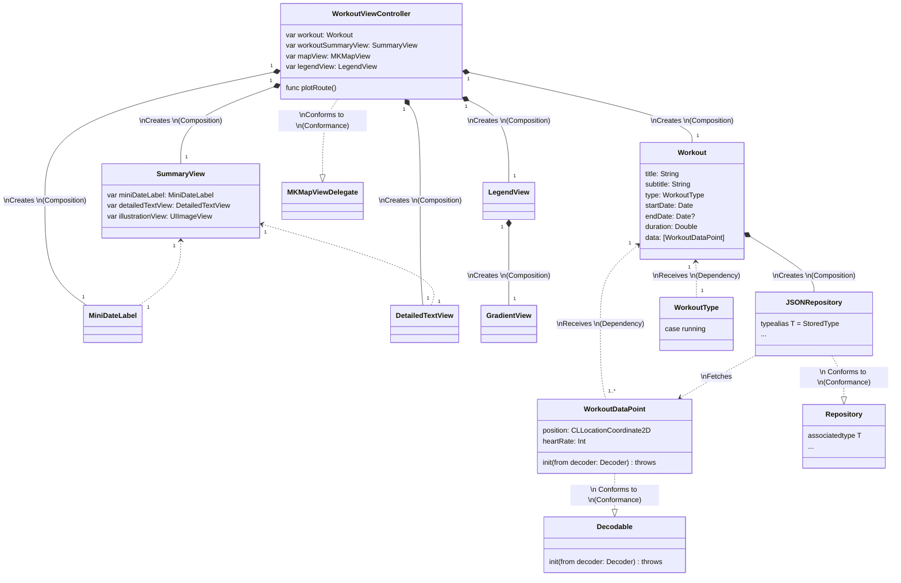

```mermaid
classDiagram

%% ========== DESCRIPTION ============ %%
%% At Future, we often want to visualize portions of a workout that a user has done, in
%% order for both the coach and client to have a clear representation of activity and 
%% progress. 
%% In this project, we'd like to plot an outdoor run completed by the client on a map.

%% The included data file "latitude_longitude_heartrate.json" contains an array of tuples
%% containing latitude, longitude and heart beat (bpm).
%% The map can be static.
%% The goal is to create a simple Swift app which displays the data on a map by drawing a 
%% plot that displays the user's route during their run, and incorporates the heart rate 
%% data into the plot as you see fit. 

%%========================================= %%

%% ============= ENTITIES ============= %%

%% CLASSES

class WorkoutViewController {
    var workout: Workout
    var workoutSummaryView: SummaryView
    var mapView: MKMapView
    var legendView: LegendView

    func plotRoute()
}

class MiniDateLabel

class DetailedTextView

class SummaryView {
    var miniDateLabel: MiniDateLabel
    var detailedTextView: DetailedTextView
    var illustrationView: UIImageView
}

class GradientView 

class JSONRepository {
    typealias T = StoredType
    ...
}

%% STRUCTS
class Workout { 
    title: String
    subtitle: String
    type: WorkoutType
    startDate: Date
    endDate: Date?
    duration: Double
    data: [WorkoutDataPoint]
}

class WorkoutDataPoint {
    position: CLLocationCoordinate2D
    heartRate: Int

    init(from decoder: Decoder) throws
}

%% ENUMS
class WorkoutType {
    case running
}

%% PROTOCOL
class Decodable {
    init(from decoder: Decoder) throws
}

class Repository {
    associatedtype T
    ...
}

class MKMapViewDelegate 

%% ========== RELATIONSHIPS ========== %%

WorkoutViewController ..|> MKMapViewDelegate : \nConforms to \n(Conformance)
Workout *-- JSONRepository : \nCreates \n(Composition)
WorkoutViewController "1" *-- "1" Workout : \nCreates \n(Composition)
WorkoutViewController "1" *-- "1" MiniDateLabel : \nCreates \n(Composition)
WorkoutViewController "1" *-- "1" DetailedTextView : \nCreates \n(Composition)
WorkoutViewController "1" *-- "1" SummaryView : \nCreates \n(Composition)
WorkoutViewController "1" *-- "1" LegendView : \nCreates \n(Composition)
LegendView "1" *-- "1" GradientView : \nCreates \n(Composition)
SummaryView "1" <.. "1" MiniDateLabel
SummaryView "1" <.. "1" DetailedTextView
Workout "1" <.. "1" WorkoutType : \nReceives \n(Dependency)
Workout "1" <.. "1..*" WorkoutDataPoint : \nReceives \n(Dependency)
JSONRepository ..> WorkoutDataPoint : \nFetches
JSONRepository ..|> Repository : \n Conforms to \n(Conformance)
WorkoutDataPoint ..|> Decodable : \n Conforms to \n(Conformance)
```