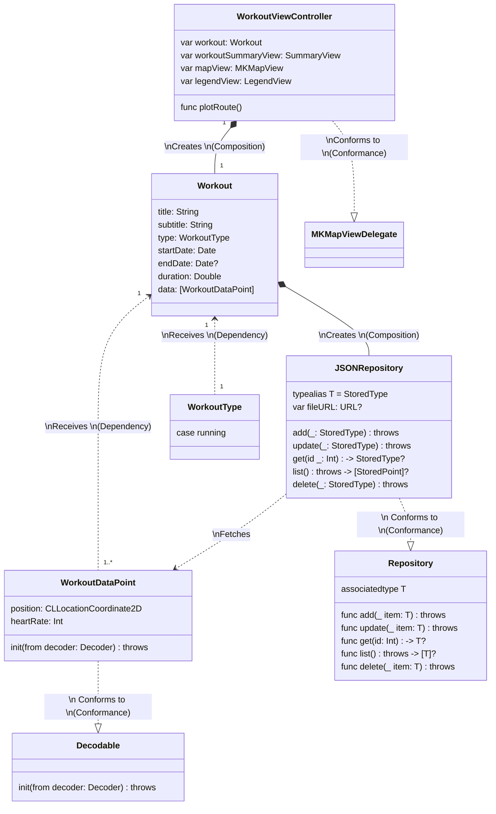

# **📱 BPM Workout Visualizer**
*Sofia Chevrolat (August 2022)*

____

## **✨ Features**
From a JSON file containing workout data points (latitude, longitude, heart rate):
- Visualize a workout summary - _date, title, subtitle and duration of your workout_ - , along with a plot of your route on a map.

- The plot is colored according to your heart rate during the workout. A minimalist legend displays the lowest and highest values.

- Supports: 
    - Accessibility Features:
        - Dynamic Type and Bold Text
        - Voice Over
    - Dark mode

___
## **🔍 Implementation overview**

### _**➡️ Overview**_
- The sample app follows an MVC architecture
- The views have been created to be as reusable as possible
- The `WorkoutDataPoint` struct conforms to `Decodable` and implements a custom `init(from decoder: Decoder) throws`
- The repository pattern is implemented for retrieving stored data, using:
    - a `Repository` protocol
    - a generic `JSONRepository` class that can be used to retrieve any type stored using JSON.

### _**➡️ Programming Concepts and Techniques**_
- MVC architecture
- Repository design pattern
- Protocols
- Generics
- Object Oriented Design (classes, inheritance)
- Composition
- Auto Layout with Safe Area
- Trait Collections
- Accessibiltiy
- Dark mode
- Programmatic UI

### _**➡️ Class Diagram**_

A full class diagram is provided in the _Documentation_ folder. 
Below is a shortened version of the most important entities:

### _**➡️ Testing**_

The app comes with a few unit tests validating the behavior of the JSONRepository, the key component of the sample app.

___

## **📲 Usage**
### _**Dependencies and Requirements**_

The following 2 packages are included:

- [SnapKit](https://github.com/SnapKit/SnapKit) for easy view positioning.
- [SwiftFormat](https://github.com/nicklockwood/SwiftFormat) for code formatting. Swift format is run at each build and enforces a set of rules declared in the accompanying `.swiftformat` file.

### _**Steps**_
- Open the project in Xcode
- Run "Resolve Package Versions" (_File > Packages_) if needed
- Run the project
    - Try different accessibility font sizes and see the UI update dynamically.
    - Try switching between dark / light mode and see the UI update dynamically.
    - Try using Voice Over to have a human-friendly read of the summary view.
- Run the tests

______
## 📝 Documentation
- Interface functions and variable are documented with DocC style comments.

These can be used to generate a documentation for the app (as of WWDC2022), that can be hosted on GitHub page or on any other website.
